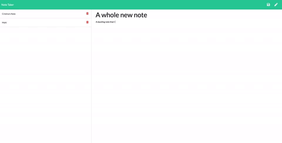

# Note Taker READ ME
        
## Summary
        
An application that enables users to create, save and delete digital notes. 

 

## Site Picture


        
## Table of Contents

- [Technologies Used](#Technologies-Used)
- [Learning Points](#Learning-Points)
- [Use](#Use)
- [Installation](#Installation)
- [Code Snippets](#Code-Snippets)
- [Contributing](#Contributing)
- [Author](#Author)
        
## Technologies Used
- Express.js - used to build an API
- Javascript / jQuery - used to build a responsive website
- HTML and Bootstrap - used in provided code
- Git - version control system for tracking changes to code
- Github - to host the repository
- Heroku - to host the deployed site

## Learning Points

Accessing and storing data
- JSON data "feels" new but it can quickly be parsed into a format that is more familiar.
- In order to delete and update json data, we need to read it first and then rewrite to file.
- Because data needs to be read first, update and write functions must wait for the read functions to complete and return output.

Accessing data through an API
- Building a simple API helped me understand my interaction with API's much better as a user.
- When we access information stored in a database we are essentially making a call to the API.

## Dependencies
```
path
express
fs
```
        
## Use
To use, follow the installation requirements and access the application on the local host connected.

## Installation
- You will need to download this folder into your computer either by cloning the git repository or downloading the files are a zip.
- Once the files are accessible in tour local computer, navigate inside the note-taker folder and do an install of the following packages by using: 
```
npm install path
npm install express
npm install fs
```
- Once you have successfully installed those packages, you can run the program by typing the following command to your terminal
```
node server.js
```


## Code Snippets
Within the delete function, splice is used to remove data values from the database. There are many steps involved because the database values are extracted, a specific value is removed and the database is re-written.

```
...
fs.readFile(path.join(__dirname,"db/db.json"), function(err, data){
        if(err){
            console.log(err)
        }
        var returnVal = JSON.parse(data)
        // removes one value at the location of the note
        returnVal.splice(noteLocation,1)

        // rewrites data into the database
        fs.writeFile(path.join(__dirname,"db/db.json"), JSON.stringify(returnVal), function(err,data){
            if(err) throw err;
            res.json(returnVal)
        });
    });  
```

  
         
## Contributors
- [Cristina Terry](https://github.com/crisdc88)
            
        
## Author
[Portfolio](https://analoo.github.io/)


       


